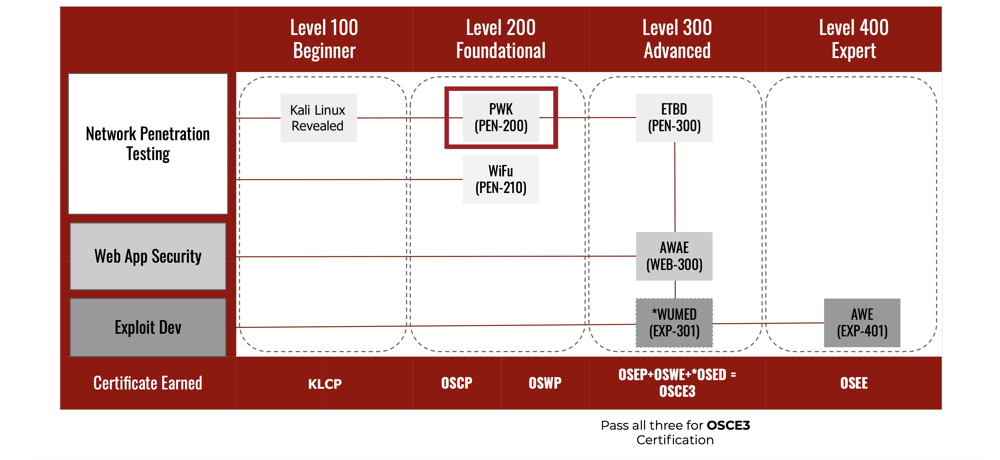

# NOTAS DE ESTUDIO PWK-OSCP

En este repositorio encontrará algunas notas de estudio realizadas durante nuestra travesia de certificarnos como OSCP.

Encontrará resumenes, explicaciones, scripts, consejos, etc...

# OSCP vs. PWK/PEN-200
PWK, tambien referido como PEN-200, es un curso (con laboratorios en línea) orientado orientado a la certificación OSPC (del inglés *Offensive Security Certified Professional*) y ofertado  tanto el certificado como el curso por Offensive Security® (abreviado *OffSec*) el cual incluye un solo intento de examen.

PWK es el acrónimo de Penetration With Kali (linux).

PEN-200 según el [sistema de designación de cursos de OffSec](https://www.offensive-security.com/courses-and-certifications/#course-track-system) desglosa: 
* PEN-: Penetration.
* -20X: Nivel de dificultad fundamental.
* -XX0: Orientado a cualquier SO.

# PWK en la ruta de aprendizaje global de OffSec®
 Fuente: https://help.offensive-security.com/hc/en-us/articles/360059535932-PEN-200-Onboarding-A-Student-Introduction-Guide-to-the-OSCP

# Prerequisitos de PWK
* Fundamentos de TCP/IP
    * Direccionamiento de IP y conexión en subredes: [Cisco - IP Addressing and Subnetting for New User](https://www.cisco.com/c/en/us/support/docs/ip/routing-information-protocol-rip/13788-3.html) [(SPA)](https://www.cisco.com/c/es_mx/support/docs/ip/routing-information-protocol-rip/13788-3.html).
    * Protocolos y servicios TCP/IP: [Service Name and Transport Protocol Port Number Registry](https://www.iana.org/assignments/service-names-port-numbers/service-names-port-numbers.xhtml)
    * Como el tráfico es entregado y recibido.

* Sistemas operativos
    * Conocimiento razonable de Linux: [Linux Journey Course](https://linuxjourney.com/) y [Kali Linux Revealed Course](https://kali.training/).
    * Active Directory: [Microsoft Active Directory Domain Services Overview](https://docs.microsoft.com/en-us/windows-server/identity/ad-ds/get-started/virtual-dc/active-directory-domain-services-overview).

* Familiaridad con lengajes de programación
    * Bash
    * Perl
    * Python

# Competencias de PWK

* Uso técnicas de recopilación de información para identificar y enumerar objetivos que ejecuten varios sistemas operativos y servicios.
* Programación de scripts y herramientas básicas para ayudar el proceso del pentesting.
* Análisis, corrección, modificación, compilación cruzada y portabilidad de código de explotación pública.
* Realización de ataques remotos, escalar privilegios locales y ataques del lado del cliente.
* Identificación y explotación de vulnerabilidades de XSS, inyección SQL e inclusión de archivos en aplicaciones web.
* Aprovechamiento de técnicas de tunelización para pivotar entre redes
* Resolucón creativa de problemas y pensamiento lateral.

# Creadores:

- [@Alejosebasp](https://twitter.com/alejosebasp)

- [@FredyAndresRo](https://twitter.com/FredyAndresRo)